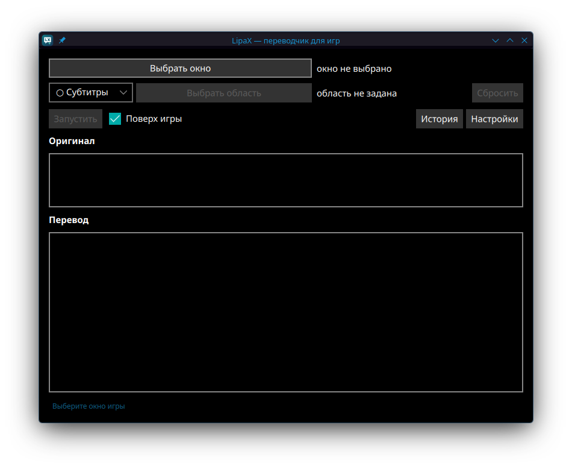
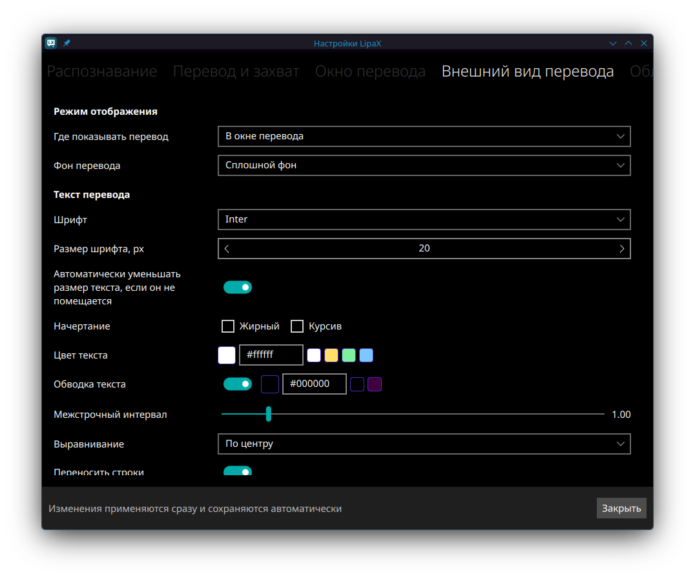

# LipaX

**Перевод игрового текста для Linux — в отдельном окне или поверх оригинала.**

[](#features)
[](#details)
[](#quick-start)
[](#installation)
[](#diagnostics)
[](#documentation)
[](#credits)
[](#english)

LipaX захватывает выбранное окно игры, распознаёт надписи и показывает перевод. Приложение рассчитано на **KDE Plasma 6 / KWin / Wayland**. Интерфейс написан на системном Qt 6.12+/QML, обработка кадров — на Rust.



<details>
<summary>Настройки внешнего вида перевода</summary>



</details>

<a id="features"></a>

## Возможности

- **Перевод во время игры.** Автоматическое слежение за текстом и разовый перевод по команде; повторные фразы берутся из кэша.
- **До трёх областей захвата.** Субтитры, диалоги и меню можно читать отдельно, временно отключать и задавать для них свои языки и движок OCR.
- **Два вида отображения.** Отдельное окно перевода поверх игры или наложение на исходный текст с подгонкой размера и переносов строк.
- **Выбор распознавания.** Tesseract, RapidOCR (PP-OCRv5), MeikiOCR (японский), PaddleOCR и режим «Авто» с повторным чтением при низкой уверенности.
- **Локальный и сетевой перевод.** Bergamot, Google Translate, Yandex Translate, DeepL, Microsoft Translator и настраиваемый API.
- **Подбор шрифта оригинала.** В режиме поверх оригинала анализируются засечки, ширина букв, моноширинность, насыщенность и наклон. Похожий шрифт выбирается из 36 встроенных семейств, включая набор kizurium (Oswald, Exo 2, Rubik, Nunito, Tektur, Press Start 2P и другие). Учитывается язык перевода; для PT Serif доступен настоящий курсив. Это подбор похожего начертания, а не гарантированное определение точного названия шрифта.
- **Настройка оформления.** Встроенные шрифты, цвет текста, фон, рамка, прозрачность, скругление, тени и обводка. Окно можно закрепить, перемещать и прокручивать, если перевод длинный.
- **Профили игр.** Области и параметры обработки запоминаются для выбранной игры при захвате через KWin.
- **Управление без переключения окон.** Настраиваемые горячие клавиши и системный трей; при включённом сворачивании в трей перевод продолжается после закрытия главного окна.
- **История и проверка OCR.** История оригиналов и переводов с копированием, просмотр распознанного текста, ручные фильтры изображения и автоподбор обработки кадра.
- **Диагностика в настройках.** Вкладка «Статус» показывает готовность движков, моделей и компонентов захвата; журнал помогает разобраться с ошибками.

<a id="details"></a>

## Особенности

### Bergamot: перевод без интернета

Bergamot переводит текст на вашем компьютере, без отправки сетевому сервису. **Нативный движок входит в Arch-пакет LipaX** — поле «Bergamot: путь к CLI» можно оставить пустым.

При выборе языковой пары LipaX проверяет сохранённый путь, собственный кэш и каталоги моделей в профилях Firefox. Найденные файлы Firefox копируются в кэш LipaX. Если подходящей модели нет, приложение скачивает её с официального CDN Mozilla и сохраняет путь в настройках.

- Все необходимые файлы проверяются по размеру и SHA-256; незавершённая загрузка не считается установленной моделью.
- Поиск и загрузка работают в фоне. Прогресс виден в настройках и подсказке трея; сворачивание приложения не прерывает загрузку.
- Для своей установки есть **Set model path manually**. Ручной набор также должен соответствовать встроенному каталогу проверенных моделей.
- После установки модели перевод работает без сети. Для первого скачивания нужен интернет; доступны только направления из каталога, без автоматического перевода через промежуточный язык.

Кэш по умолчанию: `~/.local/share/LipaX/bergamot-models/<пара>/` (учитывается `XDG_DATA_HOME`). Подробнее: [настройка Bergamot](docs/Bergamot.md).

### Распознавание: несколько движков

| Движок | Что нужно | Особенности |
|---|---|---|
| **Tesseract** | Языковые данные `tesseract-data-*` | Движок по умолчанию; поддерживает несколько выбранных языков. Английские данные входят в зависимости Arch-пакета. |
| **RapidOCR (PP-OCRv5)** | ONNX Runtime и модель, скачанная в настройках | Работает внутри приложения без Python. Модель выбирается по основному языку; доступны настройка потоков и GPU при поддержке установленной библиотеки. |
| **PaddleOCR** | Отдельное окружение Python с PaddleOCR | Необязательный движок, читает основной язык; установка описана в отдельной инструкции. |
| **MeikiOCR (японский)** | ONNX Runtime и модель, скачанная в настройках (около 46 МБ, LGPL-3.0) | Работает внутри приложения без Python. Читает только японский текст игр, включая вертикальный. |
| **Авто** | Tesseract и настроенные дополнительные движки | При низкой уверенности Tesseract пробует MeikiOCR (японский, если модель скачана), затем RapidOCR; если тот недоступен — PaddleOCR. |

**Модели RapidOCR и MeikiOCR скачиваются только по кнопке «Скачать»** во вкладке «Распознавание» (при смене языка приложение предлагает скачать недостающую модель, но не скачивает её само). Размеры и SHA-256 проверяются перед установкой; для самого распознавания сеть не нужна. Источники моделей — RapidAI/RapidOCR и rtr46/meikiocr. Инструкции: [RapidOCR](docs/RapidOCR.md), [MeikiOCR](docs/MeikiOCR.md), [PaddleOCR](docs/PaddleOCR.md).

### Сервисы перевода и повторные фразы

| Сервис | Подключение |
|---|---|
| **Bergamot** | Локальный движок и модель языковой пары; API-ключ не нужен. |
| **Google Translate** | Сетевое подключение. |
| **Yandex Translate** | Параметры доступа во вкладке «Перевод»: API-ключ и folder ID. |
| **DeepL** | API-ключ во вкладке «Перевод». |
| **Microsoft Translator** | API-ключ и регион ресурса. |
| **Свой API** | Адрес сервиса и, если требуется, ключ доступа. |

Сетевые переводчики получают распознанный текст. При ошибке Bergamot приложение не переключается автоматически на облачный сервис.

Кэш уменьшает число повторных запросов. Для отдельного окна перевода можно включить перевод только изменившихся абзацев: неизменный текст берётся из кэша, но новые абзацы переводятся отдельно, без общего контекста.

### Захват и работа поверх игры

LipaX использует KWin ScreenShot2, а в качестве запасного варианта — захват через Portal. Для наложения перевода на исходный текст нужна геометрия окна от KWin; **при Portal-захвате используется отдельное окно перевода**.

Средняя кнопка мыши на отдельном окне перевода переключает закрепление. В режиме наложения она скрывает перевод; вернуть его можно переключателем в главном окне. Отображение поверх полноэкранной игры и размещение на мониторах с разным масштабом зависят от конфигурации окружения.

<a id="quick-start"></a>

## Быстрый старт

1. **[Установите LipaX](#installation)** и запустите `lipax` из меню приложений или терминала.
2. **Настройте распознавание.** Во вкладке «Распознавание» выберите язык текста игры. Для первого запуска можно оставить Tesseract; проверьте наличие данных нужного языка.
3. **Настройте перевод.** Во вкладке «Перевод» выберите целевой язык и сервис. Для локального перевода выберите **Bergamot (локально)**, задайте исходный язык и дождитесь статуса **Found**. Автоопределение исходного языка Bergamot не поддерживает.
4. **Выберите игру и текст.** Нажмите «Выбрать окно», затем «Выбрать область» и обведите субтитры, диалог или меню. Небольшая область с текстом обычно удобнее захвата всего кадра.
5. **Запустите слежение.** Выберите вид перевода и нажмите «Запустить». Дополнительные зоны настраиваются во вкладке «Область».

Если перевод не появился, откройте «Просмотр OCR» и проверьте, читается ли оригинал, затем посмотрите вкладку «Статус». Для RapidOCR сначала установите ONNX Runtime и скачайте модель кнопкой в настройках. Чтобы работа продолжалась при закрытом главном окне, включите «Сворачивать в системный трей при закрытии».

<a id="installation"></a>

## Установка

### Готовый Arch-пакет

Если у вас уже есть пакет версии `1.3.1`, установите его из каталога с файлом:

```bash
sudo pacman -U ./lipax-1.3.1-1-x86_64.pkg.tar.zst
```

Пакет устанавливает команду `lipax`, ярлык приложения, встроенные шрифты и движок Bergamot. Модели перевода и RapidOCR скачиваются отдельно через приложение. После обновления полностью закройте LipaX через меню трея и запустите снова.

### Сборка на Arch Linux

Установите инструменты сборки и Git, затем соберите пакет с зависимостями из `PKGBUILD`:

```bash
sudo pacman -S --needed base-devel git
git clone https://github.com/GrayRats/lipax-qt.git
cd lipax-qt
makepkg -si
```

Для сборки снимка текущих файлов проекта, включая локальные изменения:

```bash
./packaging/build-local.sh -s
sudo pacman -U dist/lipax-1.3.1-1-x86_64.pkg.tar.zst
```

Дополнительные компоненты устанавливаются по необходимости:

| Задача | Что установить |
|---|---|
| Читать русский текст через Tesseract | `sudo pacman -S tesseract-data-rus` |
| Читать другой язык через Tesseract | Соответствующий пакет `tesseract-data-*`; состояние языков видно в настройках. |
| Использовать RapidOCR на CPU | `sudo pacman -S onnxruntime-cpu`, затем скачать модель в настройках. |
| Использовать PaddleOCR | Окружение по [инструкции](docs/PaddleOCR.md). |

### Запуск локальной сборки

Для проверки захвата KWin запускайте приложение через:

```bash
./packaging/run-local.sh
```

Скрипт собирает приложение и регистрирует отдельную скрытую desktop-запись для пути локального бинарника. Для уже собранного бинарника:

```bash
LIPAX_LOCAL_BINARY=/полный/путь/к/lipax ./packaging/run-local.sh
```

Сначала закройте другой экземпляр LipaX: повторный запуск передаёт команды уже работающему приложению. Регистрация установленного приложения сохраняется. Удалить регистрацию локальной сборки можно командой `./packaging/run-local.sh --unregister`.

<a id="diagnostics"></a>

## Диагностика и ограничения

| Симптом | Что проверить |
|---|---|
| OCR не видит текст или читает мусор | Язык и данные OCR, границы области, «Просмотр OCR», фильтры и порог уверенности. |
| Модель Bergamot отсутствует | Подключитесь к сети и нажмите «Найти / скачать модель» в настройках; дождитесь **Found**. |
| Не запускается движок Bergamot | Проверьте установку пакета со встроенным движком и поле пути к CLI. Для штатного пакета поле можно оставить пустым. |
| RapidOCR сообщает об отсутствии библиотеки или модели | Установите ONNX Runtime, скачайте модель во вкладке «Распознавание» и нажмите «Проверить снова». |
| Сервис перевода вернул HTTP 429 | Достигнут лимит запросов. Дождитесь снятия ограничения и повторите перевод; автоматические повторы после 429 останавливаются. |
| `ScreenShot2.Error.NoAuthorized` | KWin не разрешил захват текущему бинарнику. Для локальной сборки используйте `packaging/run-local.sh`; для установленной — перезапустите приложение после обновления. |
| Наложение на исходный текст недоступно | Проверьте источник захвата: Portal не сообщает положение выбранного окна. |

KWin связывает разрешение ScreenShot2 с путём исполняемого файла в desktop-записи: ярлык пакета разрешает `/usr/bin/lipax`, но не `target/debug/lipax`. Если кэш KDE устарел, выполните `kbuildsycoca6`. В режиме «Авто» отказ KWin при проверке доступа приводит к выбору окна через Portal; вкладка «Статус» показывает готовность захвата.

Если сохранённая настройка не применилась к уже открытому окну или захвату, полностью закройте приложение и запустите снова. Совместимость наложения с конкретной полноэкранной игрой и размещение между мониторами с разным масштабом стоит проверить в своём окружении.

При запуске из терминала журнал доступен в консоли. Для подробного вывода и сохранения в файл:

```bash
RUST_LOG=debug lipax
RUST_LOG=debug lipax 2>&1 | tee lipax.log
```

По умолчанию включён уровень `INFO`; `ERROR` идёт в stderr, остальные сообщения — в stdout.

<a id="documentation"></a>

## Документация

| Раздел | Содержание |
|---|---|
| [Bergamot](docs/Bergamot.md) | Локальный перевод, автоматический поиск моделей, ручной путь и проверка файлов. |
| [RapidOCR](docs/RapidOCR.md) | ONNX Runtime, языки и модели, GPU, настройки и результаты замеров. |
| [MeikiOCR](docs/MeikiOCR.md) | Японский текст игр: модели, вертикальный текст, результаты замеров. |
| [PaddleOCR](docs/PaddleOCR.md) | Установка Python-окружения и подключение движка. |
| [Журналирование](docs/LOGGING.md) | Уровни, компоненты и сбор диагностических сообщений. |
| [Архитектура](docs/ARCHITECTURE.md) | Устройство приложения, захват, конвейер обработки и интерфейс. |
| [Доработки и ограничения](docs/IMPROVEMENTS.md) | Реализованные изменения и технические ограничения. |

<a id="credits"></a>

## Автор и используемые проекты

Автор: **GrayRat**.

- [Исходный проект Lipa](https://github.com/satix-one/lipa)
- [meikipop](https://github.com/rtr46/meikipop)
- [Tesseract OCR](https://github.com/tesseract-ocr/tesseract) и [языковые данные](https://github.com/tesseract-ocr/tessdata)
- [PaddleOCR](https://github.com/PaddlePaddle/PaddleOCR)
- [RapidOCR](https://github.com/RapidAI/RapidOCR)
- [MeikiOCR](https://github.com/rtr46/meikiocr)
- [Bergamot Translator — Mozilla](https://github.com/mozilla/bergamot-translator)

## English

**LipaX translates game text on KDE Plasma 6 / KWin / Wayland.** It captures a selected window, reads text with Tesseract, RapidOCR or optional PaddleOCR, and shows translations in a separate window or over the original text. You can configure up to three capture regions, save game profiles, customize appearance, use hotkeys, and keep translation running in the system tray.

Translation providers include Google Translate, Yandex Translate, DeepL, Microsoft Translator, a custom API, and **local Bergamot**. The Arch package includes the native Bergamot engine. LipaX searches saved paths, its own cache and Firefox model directories, then downloads missing models from Mozilla. Files are verified by size and SHA-256; progress remains visible while the app is in the tray. Once the model is installed, translation works offline.

**RapidOCR** runs PP-OCRv5 models through ONNX Runtime without Python. Install `onnxruntime-cpu` and download a model explicitly in Settings. Tesseract remains the default; Auto mode asks RapidOCR for a second reading when Tesseract has low confidence, with PaddleOCR as a fallback if RapidOCR is unavailable.

On Arch Linux:

```bash
sudo pacman -S --needed base-devel git
git clone https://github.com/GrayRats/lipax-qt.git
cd lipax-qt
makepkg -si
```

Start `lipax`, set the OCR and translation languages, choose a translation provider, select the game window and text region, then press **«Запустить» (Start)**. For Bergamot, choose an explicit source language and wait for **Found** before translating. The bundled CLI path can be left empty.

In-place translation requires KWin window geometry; Portal capture uses the separate translation window. For a local development build, use `packaging/run-local.sh` to register its executable path with KWin. Close any existing LipaX instance first. Fullscreen overlays and mixed-scale monitor placement should be checked with your game and desktop setup.

Use the **«Статус» (Status)** tab and `RUST_LOG=debug lipax` for diagnostics. HTTP 429 means a translation service has rate-limited requests. See the [documentation index](#documentation) for setup guides and technical details.

Подробности интерфейса, политика применения настроек и результаты проверок: [UI-MODERNIZATION.md](docs/UI-MODERNIZATION.md).
